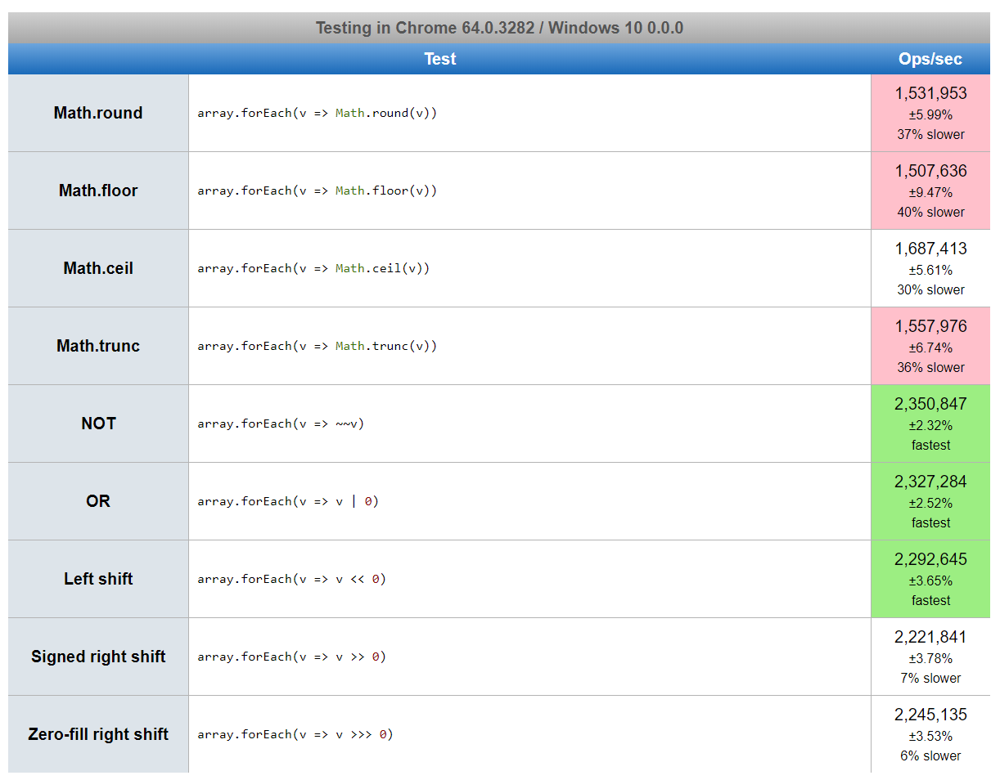

# Bits of info

-   Always add JS script at the end of the html elements, because our browser parses the HTML from top down. Thus if we add JS script in the `head` tag or in the `body` tag then the browser might spend some extra time parsing the JS code, which can lead to bad user experience.

-   Always declare JavaScript variables with `var`,`let`, or `const`. The `var` keyword is used in all JavaScript code from `1995 to 2015`. The let and const keywords were added to JavaScript in 2015. If you want your code to run in older browsers, you must use var.

## Different types of use of equals to sign:- 🧨🧨

-   Equal to (`=`) is an assignment operator, which sets the variable on the left of the = to the value of the expression that is on its right. This operator assigns left hand value to right hand value. For example, Writing a=10 is fine. If we write 10=10, ‘a’ = 10 or ‘a’ = ‘a’, it will result in a reference error.

-   `==` only checks the values of the comparison regardless of their datatype. But `===` checks the values as well as the datatypes of the variable.

    ```Javascript
    let var_x = 10;  // Assignment
    let str_x = "10";

    console.log(var_x == str_x);  // >> True
    console.log(var_x === str_x);  // >> False
    ```

## Semi-colons 🔥🔥

-   In JavaScript, semicolons are optional. which means

    ```Javascript
    // Both statements work the same way
    console.log("Hello")
    console.log("Hello");
    ```

    How ever in `for loops` we need to use a (`;`).

    ```Javascript
    const numbers = [1, 2, 3, 4, 5];
    for (let i = 0; i < numbers.length; i++) {
        console.log(numbers[i]);
    }
    ```

-   **Optional use of `;`**:

    ```Javascript
    let i;                        // variable declaration
    i = 5;                        // value assignment
    let x = 9;                    // declaration and assignment
    var fun = function() {...};   // function definition
    alert("hi");                  // function call
    ```

## Automatic Semi-colon insertion in JavaScript

-   JavaScript is clever and it can add the semicolons where needed automatically. This happens behind the scenes and you will not notice it. This process is called `Automatic Semicolon Insertion(ASI)`.

## Awkward features

-   "1" and 2 can be added(_concatenated_) to form a string. 😨

```JS
console.log(1+2);  // Integer value: 3
console.log("1" + 2);  // Output is a concatenated string: "12", Here "1" is a string and 2 is a number resulting a string "12".
```

## First-class Function

-   A programming language is said to have First-class functions when functions in that language are treated like any other variable. For example, in such a language, a function can be passed as an argument to other functions, can be returned by another function and can be assigned as a value to a variable.

-   declaration on steroid 🔥

    ```js
    const foo = param => {
        console.log(`foobar, param is ${param}`);
    };

    foo(10); // Invoke it using the variable
    ```

## Math.floor() vs Math.trunc() vs Math.round() vs Math.celi()

`Math.trunc()` cuts away (truncates) the decimal places.  
`Math.round()` rounds towards closest integer number.  
`Math.floor()` rounds towards closest lower integer number(towards infinity). 3.5 -> 3 -3.5 -> -4  
`Math.ceil()` rounds towards closest higher integer number(towards infinity). 3.5 -> 4 -3.5 -> -3



```JS
let a = 1.1
console.log(a)  // Output: 1.1
console.log(`floor -> ${Math.floor(a)}`);  // Output: floor -> 1
console.log(`trunc -> ${Math.trunc(a)}`);  // Output: trunc -> 1
console.log(`round -> ${Math.round(a)}`);  // Output: round -> 1
console.log(`celi -> ${Math.ceil(a)}`);  // Output: celi -> 2
console.log("--------------------------");

a = 1.6
console.log(a);  // Output:
console.log(`floor -> ${Math.floor(a)}`);  // Output: floor -> 1
console.log(`trunc -> ${Math.trunc(a)}`);  // Output: trunc -> 1
console.log(`round -> ${Math.round(a)}`);  // Output: round -> 2
console.log(`celi -> ${Math.ceil(a)}`);  // Output:  celi -> 2
console.log("--------------------------");

a = -3.1
console.log(a)  // Output:
console.log(`floor -> ${Math.floor(a)}`);  // Output: floor -> -4
console.log(`trunc -> ${Math.trunc(a)}`);  // Output: trunc -> -3
console.log(`round -> ${Math.round(a)}`);  // Output: round -> -3
console.log(`celi -> ${Math.ceil(a)}`);  // Output: celi -> -3
console.log("--------------------------");

a = -3.6
console.log(a)  // Output:
console.log(`floor -> ${Math.floor(a)}`);  // Output: floor -> -4
console.log(`trunc -> ${Math.trunc(a)}`);  // Output: trunc -> -3
console.log(`round -> ${Math.round(a)}`);  // Output: round -> -4
console.log(`celi -> ${Math.ceil(a)}`);  // Output: celi -> -3
```
